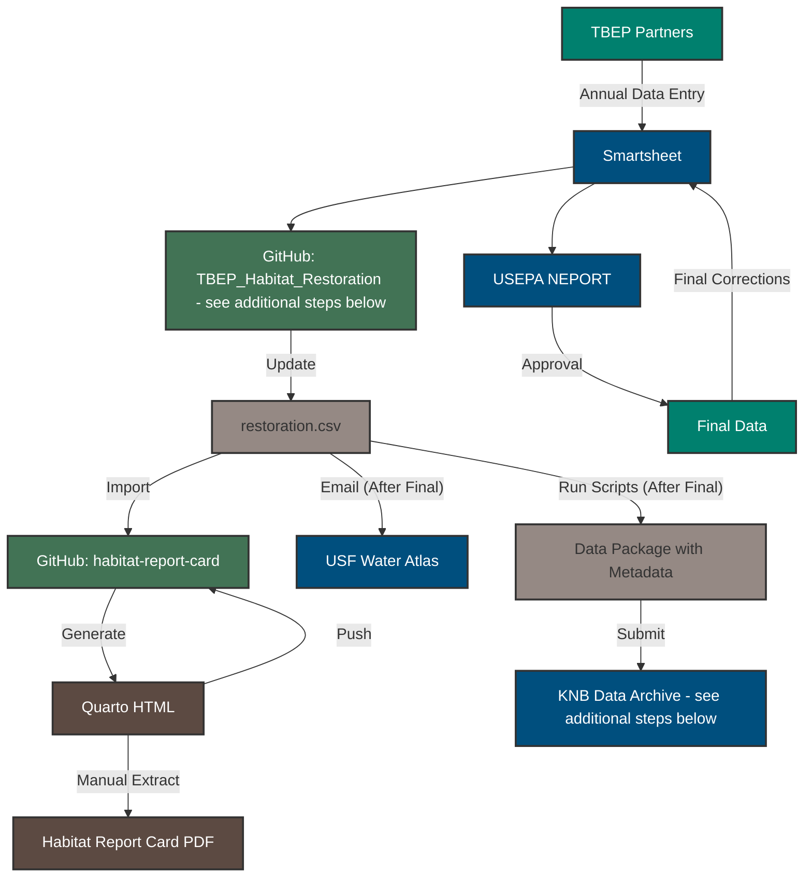

# TBEP_Habitat_Restoration

This dataset contains a comprehensive list of habitat restoration projects conducted in Tampa Bay and its watershed from 1971 to the present. Records prior to 2006 were compiled during the Tampa Bay Estuary Program's Habitat Master Plan Update (HMP, 2020). Since 2006, habitat restoration data are reported to the Tampa Bay Estuary Program by regional partners and submitted each year to the US Environmental Protection Agency (EPA) through the National Estuary Program Online Reporting Tool (NEPORT) to conform to the Government Performance and Results Act (GPRA). The dataset includes information on each project including name, date, location, restoration activity, habitat type, partner responsible for the project, and approximate coverage. The dataset is updated annually.

The archived dataset is available on KNB at: <https://doi.org/10.5063/F1J101NP>

Please see the [sas](https://github.com/tbep-tech/TBEP_Habitat_Restoration/tree/sas) branch for the original SAS code used to clean and merge the two data sources.

The workflow for updating data in this repository that then updates multiple downstream products is shown below.  

## Updating `restoration.csv`

Once USEPA approval is given and final approvals are made, the data is updated in the `restoration.csv` file in this repository. The steps to update the `restoration.csv` file are as follows:

1. Pull the most recent version of this repository to the local version. 
1. All of the contents of [`R/00_smartsheetimport.R`](https://github.com/tbep-tech/TBEP_Habitat_Restoration/blob/main/R/00_smartsheetimport.R) must be run.  This file retrieves the updated data from the Smartsheet and appends it to the existing data in `restoration.csv`.  Ensure the following before running the script.
     *  Running this file requires an installation of the R package `rsmartsheet`.  Uncomment and run line 1 to install the package if it is not already installed.
     * An authentication token from Smartsheet is also needed and saved as an environmental variable. A token can be retrieved in Smartsheet by going to your account, then Apps and Integrations, then API Access.  Generate the new access token and copy it to your local computer as it cannot be retrieved again after it is created.  This token must be stored in the `.Renviron` file, which can be edited by running `usethis::edit_r_environ()`.  Add a line to the file that looks like `smartsheets_key=your_token_here`.  Save the file and restart R.  The token will be available as `Sys.getenv("smartsheets_key")`.
     * Change [line 5](https://github.com/tbep-tech/TBEP_Habitat_Restoration/blob/a8b0d9b96e70815fc9fc9c3b3a0eb967e82edbb3/R/00_smartsheetimport.R#L5) to the current year.
     * Do not run the script more than once.  Running the script multiple times will append the data multiple times.
1. Once the files are updated, commit the changes to the repository and push the changes to GitHub.
1. Follow the instructions [below](https://github.com/tbep-tech/TBEP_Habitat_Restoration/tree/main?tab=readme-ov-file#updating-knb-repository) to update the KNB archive and the instructions on the README for the [habitat-report-card](https://github.com/tbep-tech/habitat-report-card/tree/main?tab=readme-ov-file#updatings-tables-and-figures) repository to update figures used in the two-pager.

## Updating KNB repository

The "official" dataset that needs to be updated each year is archived on [KNB](https://knb.ecoinformatics.org/view/doi:10.5063/F1J101NP). This should only be done after the data are approved by USEPA and the file `restoration.csv` is updated as above. The steps to update the KNB repository are as follows:

1. Open the script [`R/03_update.R`](https://github.com/tbep-tech/TBEP_Habitat_Restoration/blob/main/R/03_update.R).
1. Before the script is run, a token for DataONE must be available in the `.Renviron` file.  Get the token from Marcus and add it to the `.Renviron` file as `dataone_token=your_token_here` using `usethis::edit_r_environ()`.  Save the file and restart R.  The token will be available as `Sys.getenv("dataone_token")`.
1. Change [line 17](https://github.com/tbep-tech/TBEP_Habitat_Restoration/blob/33f966aae6066bf062a5d629f424f2de92077efa/R/03_update.R#L17) to the current version ID. This should be available at the of the page for the [repository](https://knb.ecoinformatics.org/view/doi:10.5063/F1J101NP).
1. Change [line 62](https://github.com/tbep-tech/TBEP_Habitat_Restoration/blob/a8b0d9b96e70815fc9fc9c3b3a0eb967e82edbb3/R/03_update.R#L62) to December 31st for the year in which the data were updated, e.g., 2024-12-31.  
1. Run the script, verify the console output (dimensions of new and old data should be different, new and old dates should be different) and that the data package has been successfully uploaded to KNB by visiting the URL.
1. Commit the changes in [`R/03_update.R`](https://github.com/tbep-tech/TBEP_Habitat_Restoration/blob/main/R/03_update.R) and push the changes to GitHub (only line 62 should be changed).

