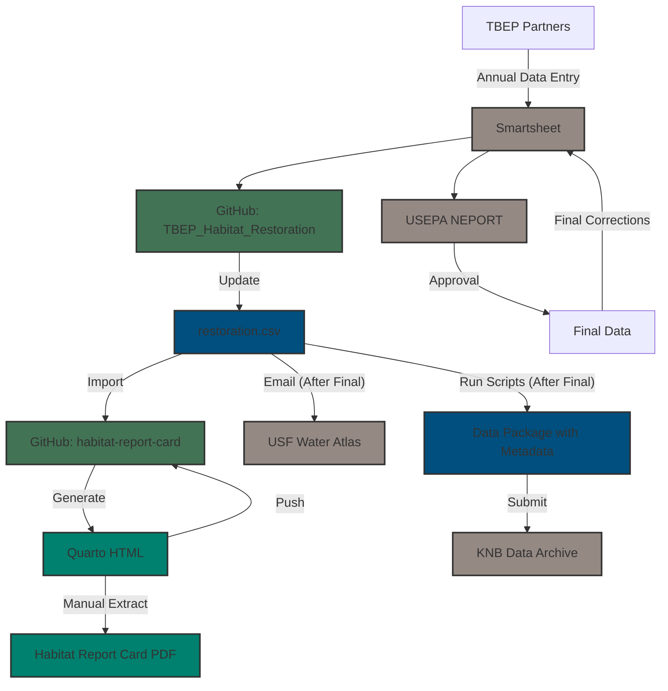

# TBEP_Habitat_Restoration

This dataset contains a comprehensive list of habitat restoration projects conducted in Tampa Bay and its watershed from 1971 to the present. Records prior to 2006 were compiled during the Tampa Bay Estuary Program's Habitat Master Plan Update (HMP, 2020). Since 2006, habitat restoration data are reported to the Tampa Bay Estuary Program by regional partners and submitted each year to the US Environmental Protection Agency (EPA) through the National Estuary Program Online Reporting Tool (NEPORT) to conform to the Government Performance and Results Act (GPRA). The dataset includes information on each project including name, date, location, restoration activity, habitat type, partner responsible for the project, and approximate coverage. The dataset is updated annually.

The archived dataset is available on KNB at: <https://doi.org/10.5063/F11Z42VZ>

Please see the [sas](https://github.com/tbep-tech/TBEP_Habitat_Restoration/tree/sas) branch for the original SAS code used to clean and merge the two data sources.

The workflow for updating data in this repository that then updates multiple downstream products is shown below.  

